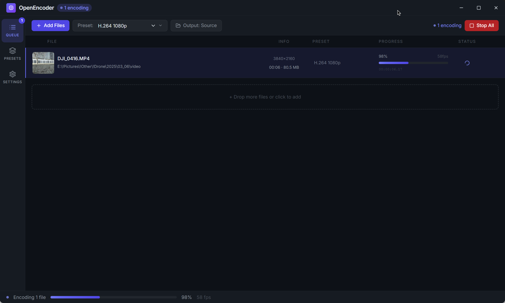

# OpenEncoder

**Open-source Adobe Media Encoder replacement** powered by FFmpeg.

A full-featured local video/audio transcoder with a modern dark UI. No subscriptions, no watermarks, no cloud dependency.



---

## ✨ Features

- **Batch encoding queue** — drag & drop or browse for files
- **16+ built-in presets** — H.264, H.265, AV1, VP9, ProRes, GIF, MP3, AAC, FLAC, Opus, WAV
- **Per-job preset selection** — assign different settings per file
- **Live progress tracking** — real-time progress bars, FPS, and ETA per job
- **Media probing** — FFprobe detects resolution, duration, codec, bitrate
- **Concurrent encoding** — 1–4 parallel jobs (configurable)
- **Custom output folders** — or output next to source
- **Frameless dark UI** — custom title bar, keyboard-friendly
- **Persistent settings** — output directory and concurrency saved across sessions
- **Error handling & recovery** — clear error messages with retry capability

---

## 🚀 Getting Started

### Installation

Download the latest release for your platform from [GitHub Releases](https://github.com/user/openencoder/releases):

- **Windows**:
  - `OpenEncoder-setup-*.exe` — Installer (recommended for most users)
  - `OpenEncoder-*.exe` — Portable executable (no installation required)
- **macOS**: `OpenEncoder-*.dmg` — DMG installer (Universal binary: Intel + Apple Silicon)
- **Linux**: `OpenEncoder-*.AppImage` — AppImage (self-contained, no dependencies)

### Usage

1. **Add files**: Drag & drop into the queue, or click "Add Files"
2. **Choose preset**: Select an output format (per-file or batch)
3. **Set output**: Choose where to save encoded files
4. **Start encoding**: Click "Start" to begin
5. **Monitor progress**: Watch real-time ETA and performance metrics

### Settings

- **Output Directory**: Default location for encoded files
- **Concurrent Jobs**: Number of simultaneous encoding tasks (1-4)
- **Theme**: Light or dark mode (persisted)

---

## 🏗️ Development

### Prerequisites
- Node.js 18+
- npm or yarn

### Setup & Build
```bash
# Install dependencies
npm install

# Run in development mode
npm run dev

# Build for distribution (all platforms)
npm run dist

# Platform-specific builds
npm run dist:win    # Windows installer
npm run dist:mac    # macOS DMG
npm run dist:linux  # Linux AppImage
```

### Quality Assurance
```bash
npm run lint       # Check code quality
npm run format     # Auto-format code
npm run test       # Run tests
npm run test:cov   # Coverage report
```

### Documentation
- **[Contributing Guide](CONTRIBUTING.md)** — Development workflow, testing, code standards
- **[Release Guide](RELEASE.md)** — Automated releases, building installers, GitHub Actions
- **[Deployment Guide](DEPLOYMENT.md)** — Pre-release checklist, signing, publishing
- **[Security Policy](SECURITY.md)** — Security considerations and best practices
- **[Changelog](CHANGELOG.md)** — Version history and updates

---

## 📋 Architecture

| Component | Technology |
|-----------|-----------|
| Shell | Electron 31 |
| Build | electron-vite + Vite 5 |
| UI Framework | React 18 + TypeScript |
| Styling | Tailwind CSS 3 |
| State Management | Zustand |
| Encoding | FFmpeg (via fluent-ffmpeg) |
| Binaries | ffmpeg-static + ffprobe-static |
| Storage | electron-store |

### Project Structure
```
src/
├── main/               # Electron main process
│   ├── index.ts        # App lifecycle, window management
│   ├── ffmpeg-service.ts  # FFmpeg probe & encode engine
│   ├── ipc-handlers.ts    # IPC channel handlers
│   ├── ipc-security.ts    # Security validation & helpers
│   ├── ipc-validation.ts  # Path & payload validation
│   └── error-handler.ts   # Global error handling
├── preload/
│   └── index.ts        # Secure renderer ↔ main bridge
├── shared/
│   ├── types.ts        # Shared TypeScript types & IPC constants
│   └── presets.ts      # Built-in encoding presets
└── renderer/src/
    ├── App.tsx
    ├── components/
    │   ├── TitleBar.tsx
    │   ├── Sidebar.tsx
    │   ├── EncodeBar.tsx
    │   ├── Queue/       # Queue panel, items, drop zone
    │   ├── Presets/     # Preset browser
    │   └── Settings/    # Settings panel
    ├── hooks/
    │   └── useFFmpeg.ts # FFmpeg event listeners
    ├── store/
    │   └── useEncoderStore.ts  # Global state (Zustand)
    └── utils.ts
```

---

## 🔒 Security

- **Sandbox isolation** — Renderer process runs in restricted sandbox
- **Context isolation** — No direct access to Node.js APIs
- **Preload bridge** — Typed IPC for all communication
- **Input validation** — All file paths and payloads validated
- **No eval()** — No dynamic code execution

See [SECURITY.md](SECURITY.md) for detailed security policies and roadmap.

---

## 📦 Adding Custom Presets

Edit `src/shared/presets.ts` and add a new entry following the `Preset` interface from `src/shared/types.ts`:

```typescript
{
  id: 'my-preset',
  name: 'My Preset',
  description: 'Custom encoding settings',
  category: 'video',
  container: 'mp4',
  videoCodec: 'libx265',
  crf: 28,
  preset: 'medium',
  format: 'h265'
}
```

The preset will automatically appear in the queue dropdown and Presets browser.

---

## 🐛 Troubleshooting

### "FFmpeg not found" error
- Ensure you downloaded the official installer, not built from source
- Try reinstalling the app

### Encoding fails with specific file
- Check file format compatibility with chosen preset
- Verify sufficient disk space (output directory)
- Check file permissions

### UI is unresponsive during encoding
- This is normal for high-bitrate or long files
- Try reducing concurrent jobs in settings
- Close other resource-intensive applications

### macOS: "OpenEncoder is damaged" or notarization warning
- Right-click the app → "Open" → "Open" (one-time bypass)
- This is a known macOS security feature; normal for unsigned apps during beta

---

## 📄 License

MIT License — See LICENSE file for details.

---

## 🤝 Contributing

Contributions are welcome! Please read [CONTRIBUTING.md](CONTRIBUTING.md) for:
- Code standards & testing requirements
- Development setup
- Release process
- Pull request guidelines

---

## 💬 Support & Feedback

- **GitHub Issues** — Bug reports and feature requests
- **Discussions** — General questions and feedback
- **Security Issues** — Report privately (see SECURITY.md)

---

## 🎯 Roadmap

- [ ] Auto-update mechanism with delta compression
- [ ] Custom preset browser with sharing
- [ ] Advanced filtering (curves, color grading)
- [ ] Subtitle/caption embedding
- [ ] Batch watermarking
- [ ] Hardware acceleration (NVIDIA NVENC, AMD VCE, Intel QSV)
- [ ] Queue persistence across restarts
- [ ] Web interface for remote encoding
